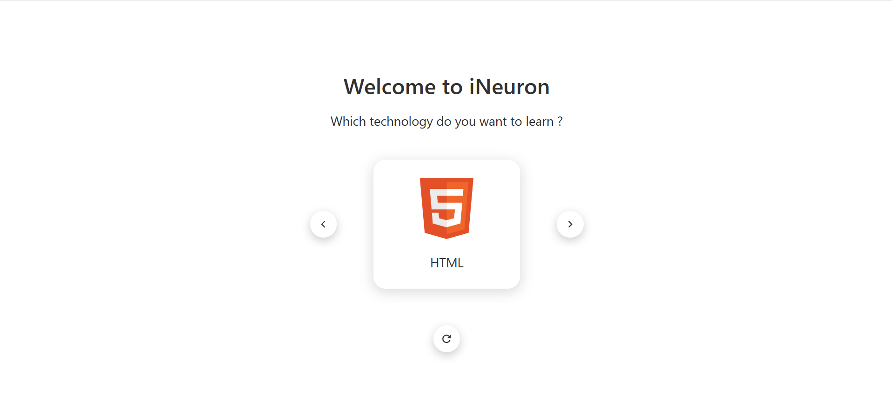

# Carousel

## Description

This project is a simple carousel app created using HTML, CSS and React.js.

## Things I learnt by creating this project :-

- What is `useState()` hook and how to use it to change the state of React app
- What are `state variables` and `setter functions`
- What are `props` and how to pass them inside `function components`
- What is meant by `rendering of component` in React

### Preview of the project :-

### [Live link]() of the project.
